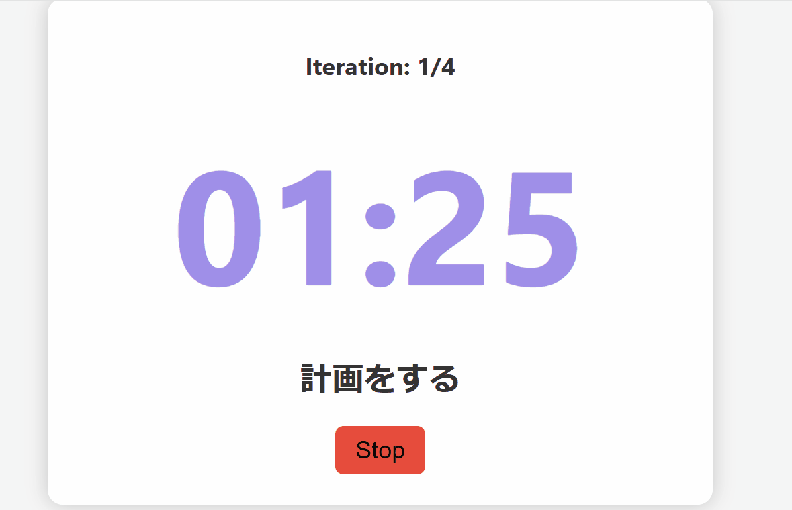

# Agile Timer

アジャイル開発を体験するためのワークショップ向けタイマーです。


## 機能

- **タスク管理**: タスクごとに時間を設定可能。
- **チームサポート**: 複数のチームでタスクを共有・管理。
- **繰り返し処理**: イテレーションを自動的に進行。
- **音声通知**: タスク終了時に通知音を再生。


## 使用方法

1. **HTMLファイルを開く**  
   このプロジェクトのHTMLファイルをウェブブラウザで開きます。

2. **設定の確認**  
   初期設定として、以下のタスクとチームが定義されています：
   - 計画をする
   - 成功期待の予想発表
   - 実行
   - 実績発表
   - 振り返り
   - 振り返り発表

  **チーム設定の変更**  
   JavaScriptファイル内でチームを変更する場合、以下のコードを編集してください：

   ```javascript
   72                this.teams = ['Team A', 'Team B'];
   ```

3. **タイマーの操作**  
   ページ上の「Start」ボタンを押してタイマーを開始します。「Stop」ボタンでタイマーを停止できます。

## 注意事項

### セキュリティ上のリスク

現在、このプロジェクトには以下のようなセキュリティ上の懸念があります：
- タイマー音声ファイル(`task_end.mp3`)はパスワード保護されておらず、誰でもアクセス可能です。
- チームやタスクデータはクライアント側JavaScriptにハードコードされており、編集する場合にはコードを直接変更する必要があります。

本番環境で使用する際には、以下を考慮してください：
- センシティブなデータをサーバー側で管理する仕組みを追加。
- ユーザー認証やデータ保護の実装。

## 開発環境

- HTML5
- CSS3
- JavaScript (ES6)

## カスタマイズ

- **チームの追加**  
  JavaScript内の`this.teams`を編集して新しいチームを追加してください。

- **タスクの追加・変更**  
  タスクデータは`this.taskData`に定義されています。タスクの名前、時間、チーム繰り返し設定を自由に変更できます。

## ライセンス

このプロジェクトはMITライセンスの下で公開されています。

## 貢献

このプロジェクトへの貢献を歓迎します。バグ報告や機能追加の提案は、Issueを通じてお願いします。また、プルリクエストもお待ちしています。
